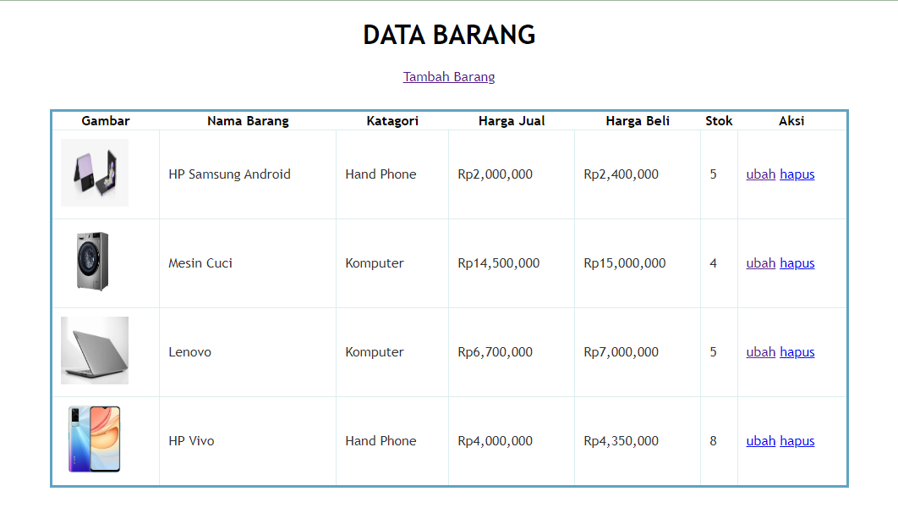

## Praktikum 3: PHP dan Database MySQL

Nama: Alvina Damayanti

Kelas: TI.21.A.3

Nim: 312110125

## 1. Menjalankan MySQL Server

## 2. Membuat Database

CREATE DATABASE latihan1;

## 3. Membuat Tabel

Code: 

Output:

## 4. Membuat Program CRUD

Buat folder lab3_php_database pada root directory web server (c:\xampp\htdocs)

## 5. Membuat file koneksi database

Buat file baru dengan nama koneksi.php dan sorce code seperti:

Output:

## 6. Membuat file index untuk menampilkan data (Read)

Buat file baru dengan nama index.php dan source code seperti:

Output:

## 7. Menambah Data (Create)

Buat file dengan nama tambah.php dan source code seperti:

Output:

## 8. Mengubah Data (Update)

Buat file dengan nama ubah.php dan sorce code seperti:

Output:

## 9. Menghapus Data (Delete)

Buat file baru dengan nama hapus.php dan source code seperti:

Output:

